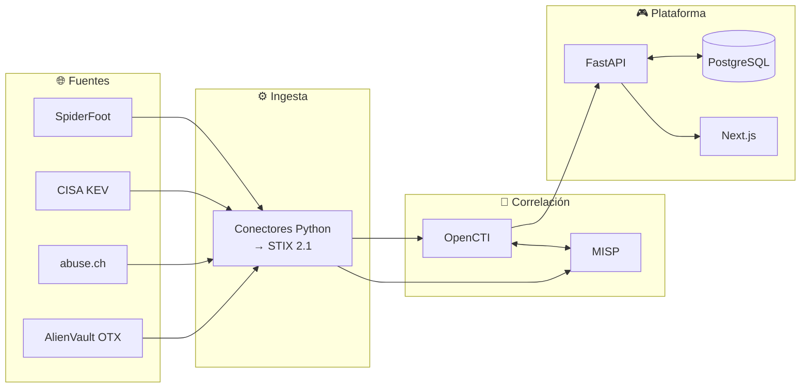

<div align="center">

```
   █████╗ ████████╗ █████╗ ██╗      █████╗ ██╗   ██╗ █████╗
  ██╔══██╗╚══██╔══╝██╔══██╗██║     ██╔══██╗╚██╗ ██╔╝██╔══██╗
  ███████║   ██║   ███████║██║     ███████║ ╚████╔╝ ███████║
  ██╔══██║   ██║   ██╔══██║██║     ██╔══██║  ╚██╔╝  ██╔══██║
  ██║  ██║   ██║   ██║  ██║███████╗██║  ██║   ██║   ██║  ██║
  ╚═╝  ╚═╝   ╚═╝   ╚═╝  ╚═╝╚══════╝╚═╝  ╚═╝   ╚═╝   ╚═╝  ╚═╝
              // C T I   O P S   A C A D E M Y //
```

**El que vigila desde arriba ve venir la amenaza primero.**

*Academia táctica de ciberseguridad sobre inteligencia de amenazas real.*


</div>

---

## 🎯 Qué es esto

**ATALAYA** es una plataforma de entrenamiento para analistas de ciberseguridad
que **no usa simulaciones**. Los ejercicios se construyen a partir de
indicadores de compromiso reales, ingeridos de fuentes OSINT vivas, modelados
en STIX 2.1 y correlacionados en OpenCTI y MISP.

Una *atalaya* es la torre de vigilancia y, a la vez, el centinela que la ocupa.
Eso es exactamente el rol que se entrena acá: ver venir la amenaza antes de que
llegue, y saber qué hacer cuando llega.

### 🪖 Doctrina

> *"Entrenar a la gente para ir a recuperar las Malvinas."*

Es la mentalidad interna del proyecto y hay que leerla como lo que es: **el
entrenamiento se toma en serio o no sirve**. Capacitación táctica, exigente y
aplicable el lunes a la mañana en un SOC de verdad — envuelta en un entorno
inmersivo que da ganas de volver.

Traducido a decisiones concretas de producto:

- 🔴 Los falsos positivos **restan** XP. En un SOC real, gritar "lobo" cuesta.
- 🔒 La XP se calcula **en el servidor**. El cliente no se regala rangos.
- 🎯 Las misiones bloqueadas **se ven igual**. Saber lo que todavía no podés
  tocar es la mitad del incentivo.
- 🧊 Los observables se muestran **siempre neutralizados** (`198[.]51[.]100[.]42`).
  Nunca clickeables.

### 🎨 Estética

Consola de un SOC del futuro: fósforo sobre vidrio negro. Rejilla holográfica,
líneas de barrido CRT, neón verde/cian/magenta/ámbar, tipografía monoespaciada
y paneles con esquina biselada. Sin humo: la severidad de la misión **manda**
sobre la armonía visual.

---

## 🏛️ Arquitectura



Detalle completo, decisiones de diseño y deuda técnica consciente:
📄 **[docs/ARQUITECTURA.md](docs/ARQUITECTURA.md)**

### 🧰 Stack

| Capa | Tecnología | Rol |
|---|---|---|
| 🌐 **Ingesta** | Python 3.12 · `httpx` · `tenacity` | CISA KEV, ThreatFox y OTX → STIX 2.1, con corroboración entre operadores |
| 🧠 **Correlación** | OpenCTI 6.4 · MISP | Grafo de conocimiento y compartición de IoCs |
| 📐 **Modelo de datos** | STIX 2.1 · MITRE ATT&CK | Único formato que cruza fronteras entre componentes |
| ⚡ **API** | FastAPI · Pydantic v2 | Feed de Misiones y motor de progresión |
| 🔐 **Identidad** | JWT + Argon2id · refresh rotativo | Sesiones revocables con detección de reutilización |
| 💾 **Persistencia** | PostgreSQL 16 · SQLAlchemy 2.0 async · Alembic | Eventos de XP append-only; la progresión se deriva de ellos |
| 🖥️ **Frontend** | Next.js 15 · React 19 · Tailwind 3.4 | Consola cyberpunk |
| 🐳 **Local** | Docker Compose (con perfiles) | 13 servicios, arrancables por partes |
| ☁️ **Nube** | Terraform 1.10 · AWS | CloudFront (plan Free + WAF) · S3 · Lambda · SSM · Neon (Postgres) |
| 🛡️ **CI/CD** | GitHub Actions | 9 puertas: secretos, lint, tests, STIX, IaC, contenedores |

---

## 🚀 Puesta en marcha

### Requisitos

| Herramienta | Versión | Necesaria para |
|---|---|---|
| Python | ≥ 3.12 | API y conectores |
| Node.js | ≥ 18.18 | Frontend |
| Docker + Compose V2 | reciente | Stack completo |
| Terraform | ≥ 1.6 | Despliegue en AWS (opcional) |

### ⚡ Ruta 1 — Sólo la consola (30 segundos, cero dependencias de red)

El frontend arranca en **modo autónomo** si la API no responde: sirve el
catálogo local y calcula la progresión del lado del cliente.

```bash
cd src/frontend && npm install && npm run dev
```

→ http://localhost:3000

### 🔧 Ruta 2 — API + consola (desarrollo normal)

La API **necesita PostgreSQL**: la progresión del analista es persistente y
arrancar sin base sería arrancar perdiendo datos en silencio.

```bash
cp .env.example .env    # ⚠️ editá los <<CAMBIAR>> antes de seguir
```

```bash
python3 -m venv .venv && source .venv/bin/activate && pip install -r src/api/requirements.txt
```

```bash
make db-up && make db-upgrade
```

```bash
cd src/api && uvicorn main:app --reload --port 8000
```

Y en otra terminal:

```bash
cd src/frontend && npm install && npm run dev
```

| Servicio | URL |
|---|---|
| 🖥️ Consola | http://localhost:3000 |
| ⚡ API | http://localhost:8000 |
| 📚 Documentación viva (Swagger) | http://localhost:8000/docs |

### 🐳 Ruta 3 — Stack CTI completo (~8 GB de RAM)

ElasticSearch no arranca sin este `sysctl`:

```bash
sudo sysctl -w vm.max_map_count=1048575
```

```bash
make env && make up-cti
```

| Servicio | URL | Notas |
|---|---|---|
| 🖥️ Consola | http://localhost:3000 | |
| ⚡ API | http://localhost:8000/docs | |
| 🧠 OpenCTI | http://localhost:8080 | Primer arranque: 2-4 min |
| 🤝 MISP | https://localhost:8443 | Certificado autofirmado |
| 🕷️ SpiderFoot | http://localhost:5001 | Perfil `hunt` |

Todos los objetivos disponibles:

```bash
make help
```

---

## 🔑 Variables de entorno

Todo sale de `.env`. La plantilla [`.env.example`](.env.example) trae los
comandos exactos para generar cada secreto:

```bash
openssl rand -hex 32       # API_SECRET_KEY
openssl rand -base64 24    # contraseñas de servicios
uuidgen                    # OPENCTI_ADMIN_TOKEN (debe ser UUIDv4)
```

> ⚠️ `.env` está en `.gitignore`. Si alguna vez lo commiteás, **rotá todo**:
> un secreto commiteado es un secreto quemado, aunque borres el commit.

---

## ⚡ API

Base: `http://localhost:8000` · Swagger interactivo en `/docs`

| Método | Endpoint | Qué hace |
|---|---|---|
| `GET` | `/health` | Sonda de **vida**. Sin dependencias externas a propósito |
| `GET` | `/health/ready` | Sonda de **preparación**: incluye PostgreSQL |
| `GET` | `/api/v1/feed` | Página del Feed de Misiones + bundle STIX 2.1 |
| `GET` | `/api/v1/feed/{id}` | Detalle de una misión |
| `GET` | `/api/v1/feed/{id}/stix` | Bundle crudo, importable en OpenCTI |
| `POST` | `/api/v1/auth/register` | Alta de analista |
| `POST` | `/api/v1/auth/login` | Inicia sesión (cookies httpOnly) |
| `POST` | `/api/v1/auth/refresh` | Rota la sesión |
| `POST` | `/api/v1/auth/logout` | Revoca del lado del servidor |
| `GET` | `/api/v1/auth/me` | Quién sos según tu token |
| `POST` | `/api/v1/level-up` 🔒 | Registra un evento de XP y resuelve el ascenso |
| `POST` | `/api/v1/missions/{id}/verdict` 🔒 | **Emite un veredicto**: qué creés y con cuánta certeza |
| `POST` | `/api/v1/missions/{id}/resolve` 🎓 | Fija la verdad y califica lo pendiente |
| `GET` | `/api/v1/analysts/{callsign}/calibration` | Cuánto vale su palabra, no cuánto trabajó |
| `GET` | `/api/v1/ranks` | Escalera completa de rangos |
| `GET` | `/api/v1/xp-table` | Cuánto vale cada acción (transparencia total) |
| `GET` | `/api/v1/analysts/{callsign}` | Estado del analista |
| `GET` | `/api/v1/leaderboard` | Ranking de la torre |
| `GET` | `/api/v1/stats` | Métricas del tablero |

🔒 requiere sesión · 🎓 requiere rol `INSTRUCTOR`. El feed y el leaderboard
son públicos: mirar no necesita cuenta, operar sí.

**Parámetros del feed:** `cursor` (opaco, para scroll infinito), `limit`
(1-100), `severity` (`low|medium|high|critical`). El rango del observador sale
del token, no de un parámetro.

```bash
curl "http://localhost:8000/api/v1/feed?limit=3&severity=critical"
```

```bash
curl -X POST http://localhost:8000/api/v1/level-up \
  -H "Authorization: Bearer $TOKEN" -H 'Content-Type: application/json' \
  -d '{"event":"ioc_verified","severity":"high"}'
```

---

## 📐 El modelo de datos

Cada misión es, por debajo, un micro-bundle STIX 2.1 coherente:

```
🔍 Indicator ──indicates──▶ 🦠 Malware ──uses──▶ 🎯 Attack Pattern
   (patrón STIX)              (is_family)          (MITRE ATT&CK)
```

El conector de referencia genera ese grafo **sin una sola dependencia externa**,
para que cualquiera pueda verlo en un contenedor pelado:

```bash
python3 src/ingestion/misp_stix_connector.py --validate
```

```
╔══════════════════════════════════════════════════════════╗
║  ATALAYA · Validación STIX 2.1                           ║
╚══════════════════════════════════════════════════════════╝
  Objetos: 11
    Grafo:
      C2 Akira — 198.51.100.42     --indicates-> Akira
      Akira                        --uses-> Data Encrypted for Impact
  [✓] Bundle STIX 2.1 estructuralmente válido.
```

| Comando | Qué hace |
|---|---|
| `--pretty` | JSON indentado |
| `--validate` | Valida y muestra el grafo |
| `-o archivo.json` | Escribe a disco |
| `--push` | Publica en OpenCTI (requiere `pycti` y token) |

> 🧪 **El catálogo de arranque es sintético a propósito**: usa rangos
> reservados por RFC 5737 y dominios RFC 2606, así que copiarlo a un firewall
> no bloquea infraestructura de terceros. Sirve para que la consola tenga algo
> que mostrar antes de conectar nada.
>
> **Los IoCs que entran por los conectores sí son reales**, y por eso el
> normalizador descarta cualquier observable que caiga en rango reservado
> antes de publicarlo como amenaza.

---

## 🔐 Identidad

**El callsign sale del token. Nunca del cuerpo de la petición.**

Esa frase es la corrección de seguridad central del proyecto. Mientras el
analista viajaba en el cuerpo, `POST /api/v1/level-up` aceptaba el nombre que
uno quisiera: alcanzaba un `curl` para ascenderse a Cazador de Amenazas, o para
vaciarle la XP a otro. `LevelUpRequest` y `VerdictRequest` **ya no tienen campo
`callsign`**, y hay tests que lo demuestran mandándolo igual.

### Cómo está armado

| Pieza | Elección | Por qué |
|---|---|---|
| Contraseñas | **Argon2id** | bcrypt trunca en 72 bytes sin avisar |
| Access token | JWT HS256, **15 min** | Sin estado, rápido de validar, imposible de revocar — por eso dura poco |
| Refresh token | Cadena opaca, **30 días**, guardada **hasheada** | Revocable y rotatoria. Un volcado de la tabla no entrega sesiones |
| Transporte | Cookies **httpOnly + SameSite=strict** | Un token que JavaScript puede leer es un token que un XSS se lleva |
| Bearer | Aceptado además de la cookie | Para `curl`, scripts y el conector de ingesta |

### Rotación con detección de reutilización

Cada renovación emite un refresh nuevo y revoca el anterior. Si aparece un
token **ya rotado**, se asume que alguien clonó la sesión y se revoca **toda la
familia** del analista. Es la recomendación del BCP de OAuth 2.0, y el
razonamiento es simple: obligar a volver a entrar molesta; dejar viva una
sesión robada, no se arregla después.

### Lo que se defiende, y cómo

| Ataque | Defensa |
|---|---|
| Otorgarse XP como otro | La identidad sale del token; el `callsign` del cuerpo se ignora |
| Fuerza bruta | 5 intentos y bloqueo de 15 min, **persistido en la base** |
| Enumeración de cuentas | Mismo mensaje y mismo tiempo de respuesta exista o no la cuenta |
| Robo de token vía XSS | Cookies httpOnly: JavaScript nunca las ve |
| CSRF | `SameSite=strict` + CORS restringido al origen conocido |
| Fijar la verdad de una misión | Rol `INSTRUCTOR`: quien fija la verdad decide quién gana XP |
| Llenar la tabla con GETs | Las lecturas ya no dan de alta analistas |

### Roles

`ANALYST` opera misiones y emite veredictos · `INSTRUCTOR` además fija la
verdad de referencia · `ADMIN` todo. **El rol no se puede declarar al
registrarse**: hay un test que lo intenta.

## 💾 Persistencia

La progresión del analista vive en PostgreSQL, y con una regla que ordena todo
lo demás: **la XP no es un contador, es una suma**.

```
analysts    → identidad y nada más
xp_events   → append-only. La XP del analista ES la suma de esta tabla
```

No existe una columna `analysts.xp`. Un contador mutable es una segunda fuente
de verdad, y toda segunda fuente de verdad termina desincronizada del historial
que la produjo. Acá el historial **es** el saldo, y de paso es la auditoría
completa de cómo cada analista llegó a su rango.

### El detalle que hace que funcione

Cada evento guarda **dos** deltas:

| Campo | Qué es | Ejemplo |
|---|---|---|
| `xp_delta_nominal` | Lo que dice la tabla de XP | `-75` |
| `xp_delta_applied` | Lo que realmente movió el saldo | `-30` (sólo tenía 30) |

Sin esa distinción, `SUM(delta)` no coincide con aplicar los eventos en orden
respetando el piso en cero, y la suma daría un saldo negativo imposible. Con
ella, `SUM(xp_delta_applied)` es exacta siempre, y el nominal queda como
evidencia de qué se intentó cobrar.

### Anti-farmeo

Un índice **parcial** único sobre `(analyst_id, mission_id, event)` impide
cobrar el mismo evento dos veces sobre la misma misión. Sin él, clickear
"Triar" cien veces sobre la misma alerta te deja en Cazador de Amenazas sin
haber analizado nada. Es parcial —`WHERE mission_id IS NOT NULL`— para que los
eventos genéricos sigan siendo repetibles.

### Migraciones

```bash
make db-upgrade                          # aplicar pendientes
make db-revision M="agregar tabla X"     # generar una nueva
make db-sql                              # ver el SQL sin aplicarlo
make db-history                          # historial y revisión actual
```

El pipeline verifica en cada push que las migraciones **se apliquen, se
reviertan y vuelvan a aplicarse**, y que el esquema desplegado coincida con
`models.py`. Una migración que no sabe volver atrás no se puede desplegar con
confianza: si el despliegue falla a mitad de camino, no hay retirada.

### Dónde corre

| Entorno | Base |
|---|---|
| Local | Contenedor `postgres:16-alpine` (`make db-up`) |
| Tests | PostgreSQL efímero vía `pgserver` — nunca SQLite |
| CI | Servicio de Postgres de GitHub Actions |
| AWS | Neon (Postgres serverless, nivel gratuito) |

Los tests corren contra PostgreSQL **real** porque el repositorio usa índices
parciales, funciones de ventana y `SELECT ... FOR UPDATE`. Contra SQLite
pasarían verdes probando otra cosa.

## 📡 Ingesta

Conectores contra fuentes OSINT reales. **Ninguna exige cuenta**, salvo OTX:

| Fuente | Operador | Qué aporta | Credencial |
|---|---|---|---|
| **CISA KEV** | CISA | Verdad **dura**: explotación activa observada | ninguna |
| **ThreatFox** (export público) | abuse.ch | IoCs con familia de malware y confianza variable | ninguna |
| **Emerging Threats** | Proofpoint | IPs comprometidas: un operador **independiente** | ninguna |
| **Spamhaus DROP** | Spamhaus | Corrobora IPs que caen en rangos secuestrados | ninguna |
| AlienVault OTX | AlienVault | Contexto de campañas; habilita hashes y dominios | `OTX_API_KEY` |

ThreatFox se lee desde su **export público** y no desde la API: la API exige una
Auth-Key, y abuse.ch ya no da alta con correo. El export trae los mismos campos.

```bash
make ingest-dry        # consulta y muestra, sin escribir nada
make ingest            # consulta y persiste las misiones
make ingest-resolve    # cierra la corroboración vencida
make ingest-loop       # ciclo continuo (perfil docker `ingesta`)
```

Sin la clave de OTX, ese conector **avisa y se saltea**; el resto funciona igual.

### No se crean misiones que no se puedan calificar

Un tipo de indicador sólo genera misiones si hay **2 operadores activos** que
puedan reportarlo. Hoy, sin OTX, hashes y dominios sólo los reporta abuse.ch:
nunca alcanzarían el umbral, y el analista apostaría sin recibir respuesta. Se
descartan. Al sumar la clave de OTX, pasan a ser calificables sin tocar código.

### Contar operadores, no APIs

Es la decisión que sostiene la corroboración, y es fácil de errar en silencio:

> ThreatFox, URLhaus y MalwareBazaar son tres APIs distintas del **mismo
> operador** (abuse.ch). Un indicador presente en las tres no está corroborado
> por tres partes: está corroborado por una, tres veces.

Si eso contara como 3, cruzaría el umbral solo y el sistema declararía verdades
que ninguna segunda parte verificó. Por eso la unidad de conteo es la
**familia** (`SourceFamily`), no el nombre de la fuente. Hay un test dedicado a
que nadie lo "optimice" después.

### Cómo se resuelve una misión

```
T+0h    Una sola fuente reporta el IoC · confianza 55
        → entra AMBIGUA · el analista apuesta a ciegas

T+72h   ¿Cuántos OPERADORES distintos terminaron corroborando?
        ≥ 2 operadores → MALICIOUS  · se califican los veredictos
        1, baja conf.  → BENIGN     · nadie más lo vio: era ruido
        1, conf. alta  → sin resolver · expira sin calificar
```

El tercer caso importa tanto como los otros dos: **no se inventa una verdad
para poder puntuar**. Enseñarle al analista una lección falsa es peor que no
enseñarle ninguna.

### Buena vecindad con las fuentes

Las APIs OSINT gratuitas se sostienen con buena fe, así que el respeto por sus
límites es parte del conector, no una opción:

- Espaciado mínimo entre peticiones, por fuente.
- Reintentos con espera creciente (2s → 4s → 8s); un `429` **corta** la corrida
  en vez de insistir.
- El catálogo KEV pesa 1,7 MB y cambia pocas veces por semana: se pide con
  petición condicional y sólo se transfiere si cambió.

> ⚠️ Medido contra el servidor real: el CDN de CISA **expone** un `ETag` pero
> **ignora** `If-None-Match` — sólo honra `If-Modified-Since`. Confiar sólo en
> el ETag, que es lo que uno escribiría por costumbre, deja la optimización
> como código muerto sin que nada falle a la vista.

Una fuente caída **nunca** tumba la corrida: cada conector se aísla, se
registra el fallo y se sigue con los demás.

## 🎯 El bucle de verificación

**Esto es el producto.** Todo lo demás es infraestructura para que funcione.

Una academia tiene que poder responder una pregunta: **¿el analista acertó?**
Sin eso, cualquier plataforma de "entrenamiento" es un clicker con estética de
SOC. Diseño completo en **[docs/VERIFICACION.md](docs/VERIFICACION.md)**.

### No premiamos acertar. Premiamos calibrar.

Un buen analista no es el que siempre acierta: es el que sabe cuánto sabe.
Quien dice *"80% de confianza"* y acierta el 80% de las veces vale más que
quien dice *"100% seguro"* y acierta el 85% — el segundo es más preciso y **más
peligroso**, porque cuando se equivoca arrastra al SOC con su certeza.

Por eso el veredicto no es un botón, es una apuesta declarada:

```bash
curl -X POST http://localhost:8000/api/v1/missions/MSN-D46B6B85/verdict \
  -H "Authorization: Bearer $TOKEN" -H 'Content-Type: application/json' \
  -d '{"call":"MALICIOUS","confidence":75,
       "rationale":"Dominio de 6 días, certificado TLS compartido con dos dominios ya marcados."}'
```

Y se califica con **Brier**, la regla estándar en torneos de pronóstico:

```
brier = (confianza/100 − resultado)²        xp = base × (1 − 4·brier)
```

| Declaró | Realidad | XP (base 100) |
|---|---|---:|
| 100% malicioso | malicioso | **+100** |
| 80% malicioso | malicioso | **+84** |
| 50% cualquiera | cualquiera | **0** |
| 80% malicioso | benigno | **−156** |
| 100% malicioso | benigno | **−300** |

Tres propiedades, y ninguna es una política del producto — las tres salen de
la matemática:

1. **Cubrirse no paga.** La pendiente 4 es el único valor que hace que declarar
   50% dé exactamente 0. No se puede farmear hedgeando.
2. **Equivocarse con certeza cuesta el triple** de lo que rinde acertar con
   certeza. En un SOC, ésa es la proporción correcta.
3. **El sistema no se puede jugar.** Brier es una *regla propia*: la estrategia
   que maximiza la XP esperada es declarar tu creencia real. Hay un test que lo
   verifica numéricamente sobre todo el rango de confianzas.

### De dónde sale la verdad

| Origen | Qué la hace verdad | Cuándo califica |
|---|---|---|
| `KEV` | Estar en el catálogo de CISA **es** explotación observada | Inmediata |
| `MULTI_SOURCE` | 3 fuentes independientes coinciden | Inmediata |
| `CORROBORATION` | **Diferida**: qué pasó en las 72 h siguientes | A las 72 h |
| `CURATED` | Un instructor escribió la respuesta | Inmediata |

La corroboración diferida es el corazón pedagógico: entrena lo único que
importa en un SOC, **decidir con información incompleta y que el tiempo te dé
o te quite la razón**. El veredicto se sella con marca de tiempo; apostar
después de que la verdad se hizo pública no puntúa.

### El catálogo tiene verdades de los dos signos

De las 8 misiones, **4 son maliciosas, 2 benignas y 2 quedan sin resolver**.
Las benignas no son decorativas: sin ellas, *"decir siempre MALICIOSO"* sería
estrategia ganadora y el sistema mediría obediencia en vez de criterio. Hay un
test que protege esa propiedad.

### La métrica que ningún producto del rubro muestra

```
GET /api/v1/analysts/gon/calibration
```

| Analista | XP | Brier | Calibración | Sobreconfianza |
|---|---:|---:|---:|---:|
| prudente | 82 | 0.122 | 0.877 | −0.350 |
| cowboy | 160 | 0.000 | 1.000 | +0.000 |
| tímido | 0 | 0.302 | 0.698 | **+0.550** |

`sobreconfianza > 0` significa que el analista **cree saber más de lo que
sabe**. Es el número que un jefe de SOC realmente quiere ver. La XP dice
cuánto trabajó; la calibración dice cuánto vale su palabra.

## 🎮 Gamificación

### Rangos

| Nivel | Rango | XP | Clearance | Desbloquea |
|:---:|---|---:|---|---|
| 1️⃣ | 🟢 **Novato** | 0 | `OBSERVADOR` | Lectura del feed, triage |
| 2️⃣ | 🔵 **Analista Junior** | 250 | `CONTRIBUYENTE` | Enriquecer IoCs, reportar, sandbox |
| 3️⃣ | 🟣 **Analista Senior** | 1.200 | `VERIFICADOR` | Verificar, correlacionar campañas, pivotear el grafo |
| 4️⃣ | 🟠 **Cazador de Amenazas** | 4.000 | `OPERADOR` | Publicar en MISP, crear misiones, desplegar YARA, proponer atribución |

### Tabla de XP

| Acción | XP | |
|---|---:|---|
| Triar una misión | +10 | |
| Enriquecer un IoC | +25 | |
| Verificar un IoC | +60 | |
| Confirmar una correlación | +120 | |
| Regla YARA aceptada | +200 | |
| Atribuir una campaña | +300 | |
| Revisión entre pares | +40 | |
| Primera sangre (misión crítica) | +150 | |
| **Publicar un falso positivo** | **−75** | ⚠️ |
| **Dejar expirar una misión** | **−15** | ⚠️ |

**Multiplicador de severidad:** baja ×1.0 · media ×1.25 · alta ×1.6 · crítica ×2.0

> Las penalizaciones **no** se multiplican por severidad, y la XP nunca baja de
> cero. Castigamos el error, no la ambición: si equivocarse en lo difícil
> costara el doble, nadie se metería con lo difícil.

---

## 🛡️ DevSecOps

El pipeline ([`.github/workflows/devsecops.yml`](.github/workflows/devsecops.yml))
corre 9 puertas en cada push y PR:

| # | Puerta | Herramienta | Rompe el build si… |
|:---:|---|---|---|
| 1 | 🔑 Secretos | TruffleHog + Gitleaks | hay un secreto verificado |
| 2 | 🐍 Lint Python | flake8 + black + bandit | estilo o SAST de severidad alta |
| 3 | 🧪 Tests | pytest | falla un test |
| 4 | 📐 Contrato STIX | validador propio + `stix2-validator` | el bundle deja de ser válido |
| 5 | ⚡ Frontend | ESLint + `tsc` + `next build` | no compila |
| 6 | 🏗️ Terraform | `fmt` + `validate` | HCL mal formado o inválido |
| 7 | 🛡️ Trivy | vulns + secretos + misconfigs IaC | CVE **CRITICAL** con fix |
| 8 | 🐳 Dockerfiles | hadolint | error de nivel `error` |
| 9 | 🚦 Puerta | consolidación | cualquiera de las anteriores falló |

Dos escáneres de secretos porque usan criterios distintos: TruffleHog
**verifica activamente** las credenciales encontradas, Gitleaks trabaja por
patrón. Se complementan.

### Verificación local

```bash
make lint && make test && make stix-validate
```

---

## ☁️ Infraestructura (AWS)

```
navegador ──HTTPS──▶ CloudFront ──┬── /*      ──▶ S3 (consola estática, privado)
                                  └── /api/*  ──▶ Lambda (FastAPI) ──▶ Neon (Postgres)
```

Una sola dirección para la consola y la API. Por eso las cookies de sesión
pueden ser `SameSite=strict` y no hace falta CORS: con dos dominios habría que
haber relajado la defensa contra CSRF.

### Por qué así

- **Lambda y no App Runner:** App Runner no acepta clientes nuevos desde el
  30/04/2026. **Y no ECS:** Lambda se apaga sola cuando no hay tráfico.
- **La misma imagen que en Docker Compose.** El Lambda Web Adapter (una capa
  en el `Dockerfile`) traduce los eventos de Lambda a HTTP; la API no se
  enteró de que corre en Lambda.
- **Costo ≈ $0** con tráfico de demo: CloudFront va en el **plan Free de
  tarifa plana** (USD 0, con WAF incluido y **sin cobro por excedentes**: un
  ataque no se convierte en factura), Lambda tiene nivel gratuito que no
  vence, S3 y ECR cuestan centavos, Neon es gratis.

### Endurecimiento incluido de fábrica

- 🧱 **WAF con 5 reglas** (el máximo del plan Free): tope global por IP,
  tope estricto para registro y login, reputación de IP, reglas base OWASP y
  entradas maliciosas (Log4Shell). Las reglas que miran el **cuerpo** sólo
  cuentan: el fundamento de un veredicto contiene, a propósito, `<script>`,
  `${jndi:...}` o URLs de C2, y bloquearlo castigaría al que analiza bien.
- 🔒 **La API sólo se alcanza a través de CloudFront.** La URL de la función
  usa `AWS_IAM` y CloudFront firma cada pedido (OAC): la URL directa da 403.
  Sin esto, cualquiera podía hablarle a la API salteándose CloudFront.
- 🧭 **La IP del limitador no la elige el cliente.** Detrás de una Function
  URL, `X-Forwarded-For` queda reducido al valor que escribe el cliente. Una
  CloudFront Function escribe la IP real en `x-atalaya-ip`, pisando cualquier
  valor recibido, y la API limita por esa.
- 🔑 **Los secretos no pasan por Terraform.** Viven en SSM Parameter Store
  (`SecureString`) y se cargan con la CLI; Terraform sólo conoce sus nombres.
  La Lambda los lee al arrancar. Si Terraform los creara, sus valores quedarían
  en texto plano en el archivo de estado.
- 🪪 **GitHub no guarda credenciales.** Despliega con un rol que asume por
  OIDC, atado al sujeto **inmutable** (`dueño@ID/repo@ID`) y sólo a `main`. El
  rol publica imágenes y actualiza el código; no puede tocar IAM ni la
  infraestructura.
- 🏷️ **Tags de ECR inmutables:** nadie reemplaza en silencio lo que corre.
- 🧱 **Bucket privado por las cuatro vías:** sólo lo lee ESTA distribución.
- 🛡️ **Cabeceras de seguridad** (CSP, HSTS de 2 años, `DENY`) con una
  CloudFront Function: el plan Free no admite políticas de cabeceras propias.
- 🔭 **X-Ray** en la Lambda: separa el arranque en frío del tiempo de cada pedido.
- 💸 **Techo de gasto natural:** la cuenta admite 10 ejecuciones concurrentes
  de Lambda; logs con retención de 14 días (por defecto, CloudWatch guarda
  para siempre).

### Despliegue

```bash
# 1. Infraestructura (humano, una vez)
cd infra/terraform && terraform init && terraform plan

# 2. Secretos, fuera de Terraform (los comandos exactos: `terraform output cargar_secretos`)
aws ssm put-parameter --type SecureString --name /atalaya/prod/api-secret-key --value "$(openssl rand -hex 32)"
aws ssm put-parameter --type SecureString --name /atalaya/prod/database-url --value "$DATABASE_URL_PROD"

# 3. Migraciones contra Neon
cd src/api && ALEMBIC_DATABASE_URL="$DATABASE_URL_PROD" alembic upgrade head
```

Después, cada push a `main` despliega solo: `imagen.yml` publica la API en
ECR y actualiza la Lambda; `consola.yml` compila el export estático, lo sube
a S3 e invalida CloudFront. Se encienden cuando existen el secreto
`AWS_CUENTA` y las variables `AWS_DISTRIBUCION_ID` y `AWS_CONSOLA_URL`.

### El detalle que muerde

`NEXT_PUBLIC_API_URL` se resuelve en tiempo de **build**: Next la incrusta en
el bundle. En AWS se compila **vacía**, así la consola llama a `/api/...` en
su propio dominio. Y como la API exige pedidos firmados por CloudFront, el
cliente manda en cada POST el hash del cuerpo (`x-amz-content-sha256`):
CloudFront firma, pero no calcula ese hash.

## 📁 Estructura

```
atalaya/
├── 📄 README.md · SECURITY.md · Makefile
├── 🔧 .env.example          # plantilla con generadores de secretos
├── 🛡️ .github/workflows/
│   ├── devsecops.yml        # 9 puertas de calidad
│   ├── imagen.yml           # API → GHCR (SBOM + procedencia) → ECR → Lambda
│   └── consola.yml          # consola → S3 → CloudFront
├── 🐳 deployments/docker/
│   └── docker-compose.yml   # 13 servicios · perfiles: (base) · cti · hunt
├── ☁️ infra/terraform/          # AWS
│   ├── cdn.tf               # CloudFront · OAC · cabeceras · función de IP
│   ├── lambda_api.tf        # API en Lambda · URL cerrada · permisos mínimos
│   ├── frontend.tf          # bucket privado de la consola
│   ├── ecr.tf               # registro con tags inmutables
│   ├── github_oidc.tf       # rol de despliegue sin claves
│   ├── funciones/           # CloudFront Functions
│   ├── main.tf · variables.tf · outputs.tf · versions.tf
├── 🧠 src/
│   ├── api/                 # FastAPI
│   │   ├── main.py          # endpoints + endurecimiento HTTP
│   │   ├── gamification.py  # motor de reglas PURO (sin estado)
│   │   ├── repository.py    # persistencia async: progresión + veredictos
│   │   ├── scoring.py       # Brier: el motor que califica los veredictos
│   │   ├── auth.py          # Argon2id + JWT (puro, sin base)
│   │   ├── auth_repository.py  # sesiones, rotación, bloqueos
│   │   ├── models.py        # SQLAlchemy: analysts + xp_events
│   │   ├── migrations/      # Alembic
│   │   ├── stix_feed.py     # generador del Feed de Misiones
│   │   ├── schemas.py · config.py · Dockerfile
│   ├── ingestion/
│   │   ├── misp_stix_connector.py   # STIX 2.1 puro, sin dependencias
│   │   ├── base.py          # contrato común · SourceFamily
│   │   ├── sources/         # cisa_kev · threatfox · emerging_threats · spamhaus_drop · otx
│   │   ├── normalize.py     # indicador crudo → misión
│   │   └── run.py           # orquestador CLI
│   └── frontend/            # Next.js 15
│       ├── app/page.tsx     # consola: panel + feed infinito
│       ├── tailwind.config.ts  # sistema de diseño cyberpunk
│       ├── components/      # VerdictPanel · CalibrationPanel · MissionCard · AccessGate
│       └── lib/             # tipos · cliente API · catálogo local
├── 📚 docs/
│   ├── VERIFICACION.md      # ← el diseño que define el producto
│   └── ARQUITECTURA.md
└── 🧪 tests/                # 162 backend + 209 frontend
```

---

## 🗺️ Hoja de ruta

- [x] Modelo de datos STIX 2.1 y conector de referencia
- [x] API del Feed de Misiones con paginación por cursor
- [x] Motor de progresión con 4 rangos y penalizaciones
- [x] Consola cyberpunk con scroll infinito y degradación autónoma
- [x] Pipeline DevSecOps de 9 puertas
- [x] Infraestructura en AWS (CloudFront + S3 + Lambda + SSM), despliegue continuo por OIDC
- [x] Persistencia en PostgreSQL con progresión derivada de eventos
- [x] Bucle de verificación con puntuación por calibración (Brier)
- [x] Autenticación con JWT + refresh rotativo y roles
- [x] Fuentes sin cuenta: CISA KEV, ThreatFox (export), Emerging Threats y Spamhaus DROP
- [x] Interfaz del veredicto con vista previa de pagos y panel de calibración
- [ ] 🟡 Sincronización bidireccional OpenCTI ↔ MISP
- [ ] 🟢 Modo competitivo por equipos (CTF con multiplicador ×2)
- [ ] 🟢 Editor de reglas YARA/Sigma con validación en vivo

---

## ⚖️ Ética y uso responsable

ATALAYA es una plataforma **defensiva y educativa**. Procesa inteligencia de
amenazas para entrenar analistas, no para atacar a nadie.

- 🚫 El repositorio **no aloja muestras de malware**. Se referencian hashes.
- 🏷️ Se respeta el **TLP** de cada objeto. Publicar TLP:RED fuera de su círculo
  destruye la relación con la fuente y, muchas veces, la investigación.
- 🧊 Los observables se muestran **neutralizados**, nunca como enlace.
- 🧪 El catálogo de demostración usa **IoCs sintéticos**.

Reporte de vulnerabilidades: **[SECURITY.md](SECURITY.md)**

---

<div align="center">

**ATALAYA** · STIX 2.1 · MITRE ATT&CK

*El que vigila desde arriba ve venir la amenaza primero.*

</div>
