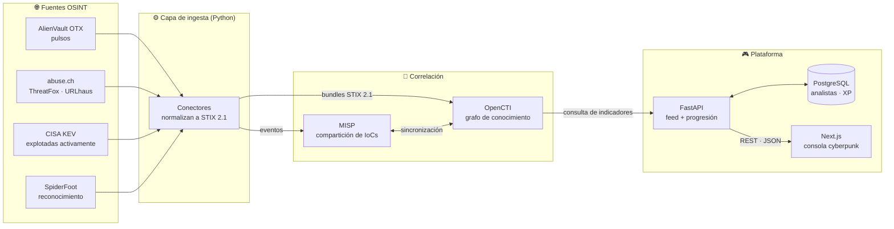
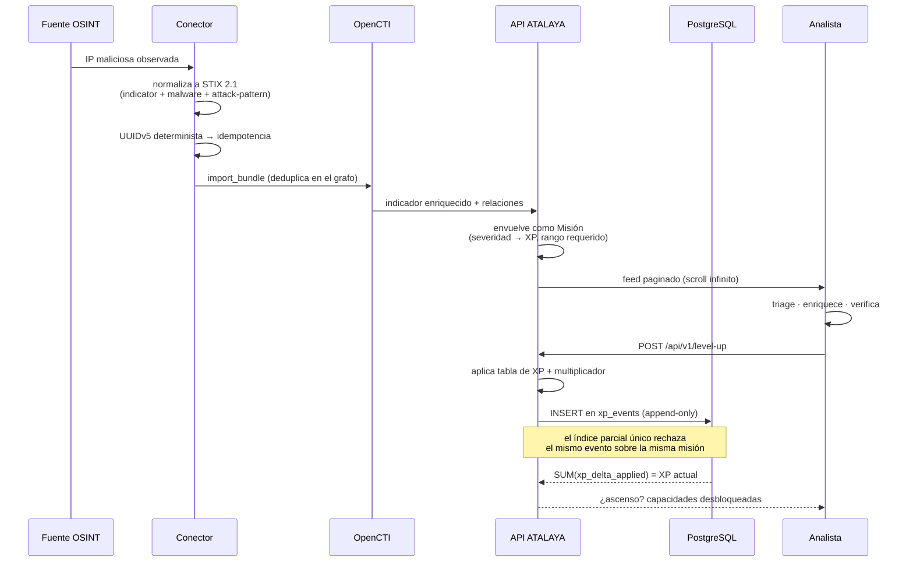
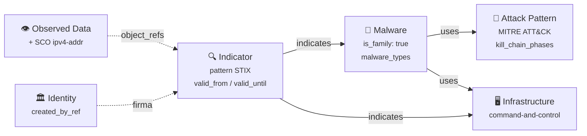
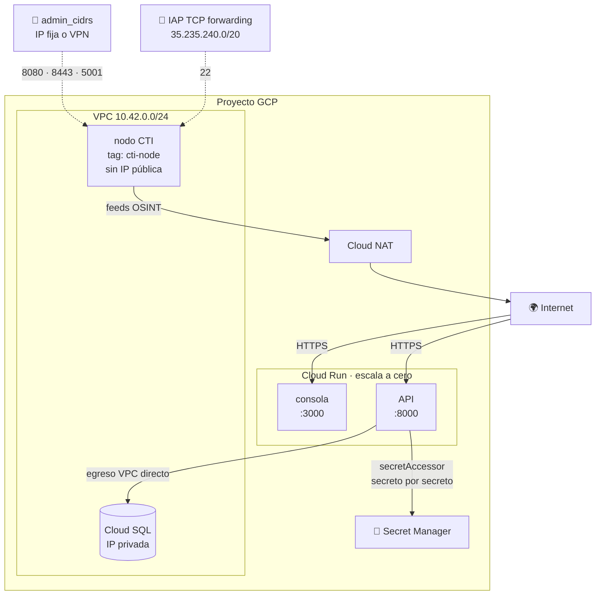

# 🏗️ ATALAYA · Arquitectura

> Documento vivo. Si cambiás el flujo de datos y no actualizás esto, el
> próximo que llegue va a leer una mentira prolija.

---

## 1. Vista de 10.000 pies

**La regla que sostiene todo:** el único formato que cruza fronteras entre
componentes es **STIX 2.1**. Ningún componente inventa su propio esquema de
indicadores. Cuando mañana entre una fuente nueva, se escribe un conector que
emite STIX y nada más se toca.

---

## 2. Recorrido de un IoC

Desde que aparece en el mundo hasta que un analista lo resuelve:

---

## 3. Decisiones de diseño y su porqué

| Decisión | Alternativa descartada | Motivo |
|---|---|---|
| **STIX 2.1 como lingua franca** | Esquema JSON propio | Interoperabilidad con OpenCTI, MISP, ATT&CK y cualquier plataforma del rubro. Un formato propio es una cárcel con vista linda. |
| **UUIDv5 determinista en los conectores** | UUIDv4 (lo que sugiere la spec) | Reingerir el mismo IoC debe actualizar, no duplicar. Con v4 el grafo se ensucia en días. |
| **XP calculada en el servidor** | Que el cliente mande el delta | Si el cliente decide cuánta XP gana, la gamificación dura hasta el primer `curl`. |
| **El callsign sale del token, jamás del cuerpo** | Confiar en el campo que manda el cliente | Con el callsign en el cuerpo, cualquiera opera en nombre de cualquiera. Es la corrección de seguridad central del proyecto. |
| **Refresh opaco en la base; access en JWT** | Refresh también en JWT | Un refresh en JWT no se puede revocar: no habría forma de cerrar sesión de verdad ni de cortar un token robado. |
| **Reutilizar un refresh revoca la familia entera** | Sólo rechazar ese token | Un token rotado que reaparece es señal de clonación. Volver a pedir login molesta; dejar viva una sesión robada, no se arregla. |
| **El contador de intentos fallidos se confirma antes de fallar** | Confiar en la transacción de la petición | La petición termina en 401 y el rollback se llevaba puesto el contador: el bloqueo por fuerza bruta no existía. |
| **XP derivada de `xp_events`, sin contador mutable** | Columna `analysts.xp` actualizada a mano | Un contador es una segunda fuente de verdad, y siempre termina discrepando del historial. Acá el historial *es* el saldo. |
| **Guardar el delta ya recortado por el piso en cero** | Guardar el nominal | Con el nominal, `SUM()` daría un saldo negativo imposible y el asiento afirmaría un descuento que nunca ocurrió. |
| **Índice parcial único por (analista, misión, evento)** | Confiar en el frontend | Sin él se farmea XP repitiendo la misma acción sobre la misma alerta. |
| **Tests contra PostgreSQL real** | SQLite en memoria | Índices parciales, funciones de ventana y `FOR UPDATE` no existen o difieren en SQLite: los tests pasarían verdes probando otra cosa. |
| **Migración como job previo, no al arrancar la API** | `create_all()` en el lifespan | Migrar desde N réplicas que arrancan a la vez es una carrera esperando a ocurrir. |
| **Penalización por falso positivo** | Sólo recompensas | En un SOC real, gritar "lobo" tiene costo. Entrenar sin ese costo produce analistas ruidosos. |
| **Penalización sin multiplicador de severidad** | Castigo proporcional | Castigar x2 por equivocarse en algo difícil desincentiva justamente lo que querés fomentar: que se metan con lo difícil. |
| **IoCs sintéticos (RFC 5737 / 2606)** | IoCs reales en el catálogo demo | Alguien va a copiar y pegar esto a un firewall. Que no bloquee infraestructura de un tercero. |
| **Contar familias de fuente, no nombres de fuente** | Contar cada API como una corroboración | ThreatFox, URLhaus y MalwareBazaar son un solo operador. Contarlos como tres haría que un IoC se corrobore a sí mismo. |
| **Sin corroboración y baja confianza ⇒ BENIGN** | Expirar todo lo no confirmado | Las misiones que enseñan a NO bloquear son tan valiosas como las otras, y sin ellas "decir siempre malicioso" gana. |
| **Evidencia a mitad de camino ⇒ sin resolver** | Forzar un veredicto para poder puntuar | Enseñar una lección falsa es peor que no enseñar ninguna. |
| **El worker de ingesta corre aparte de la API** | Una tarea de fondo dentro del proceso web | Si una fuente cuelga la conexión, no puede llevarse puesta la consola. |
| **Defang obligatorio en la UI** | Mostrar el observable crudo | Un feed de amenazas con URLs clickeables es un incidente esperando a ocurrir. |
| **Degradación autónoma del frontend** | Pantalla de error | Un entorno de entrenamiento que muere cuando muere el backend no entrena a nadie. |
| **Perfiles en Docker Compose** | Un compose monolítico | El stack CTI completo pide ~8 GB. Nadie debería necesitar eso para tocar el frontend. |
| **`admin_cidrs` sin default en Terraform** | Default `0.0.0.0/0` | El "lo abro a todos por ahora" queda para siempre. Terraform aborta el plan. |

---

## 4. Modelo de datos

El grafo mínimo que emite cada conector:

**Marcado TLP.** Todo objeto lleva `object_marking_refs`. Los IDs de las
marcas TLP están definidos por la propia spec STIX 2.1, así que se referencian
por ID y no se embeben: toda plataforma seria ya los tiene precargados.

**Nota histórica:** la spec conserva el nombre `TLP:WHITE`; TLP 2.0 lo renombró
a `TLP:CLEAR`, pero el objeto de marcado es el mismo.

---

## 5. Capas de red (GCP)

**La diferencia de modelo respecto de AWS.** En GCP no existe el security
group adjunto a la instancia: el firewall es de VPC y se aplica por
`target_tags` o por `target_service_accounts`. Esto último es lo correcto —
concede por identidad y no por una etiqueta que cualquiera puede ponerse — y
es hacia donde debería migrar `allow_cti_admin`.

**El 22 nunca se abre a Internet.** IAP hace el forwarding TCP desde un rango
publicado y fijo; la autenticación es la identidad de Google del operador y
queda auditada. Es el reemplazo del bastión con IP pública.

**Los secretos no pasan por Terraform.** El código crea el contenedor; el
valor se carga con `gcloud secrets versions add`. Si el valor entrara por
Terraform quedaría en texto plano en el archivo de estado — y el estado suele
tener más lectores que el secreto que protege.

## 6. Qué falta (deuda consciente)

| Pendiente | Impacto | Prioridad |
|---|---|---|
| Rate limiting distribuido (hoy es por proceso) | Con N workers hay N contadores | 🟡 Media |
| El feed recicla el catálogo indefinidamente (`has_more` siempre true) | Con 6 misiones, el scroll infinito repite las mismas en bucle visible | 🟡 Media |
| La URL de CORS del frontend se arma a mano en Terraform | Si el proyecto usa el otro formato de URL de Cloud Run, el navegador bloquea la API | 🟡 Media |
| Firewall por `target_service_accounts` en lugar de `target_tags` | Una etiqueta la puede reclamar cualquier instancia | 🟡 Media |
| Proveedor OIDC además de contraseñas locales | Hoy cada quien mantiene una contraseña más | 🟡 Media |
| Doble token anti-CSRF además de SameSite | SameSite=strict alcanza hoy, pero es una sola capa | 🟢 Baja |
| Sincronización bidireccional OpenCTI ↔ MISP | Duplicación manual de eventos | 🟢 Baja |
| Dominio propio + Cloud Armor delante de Cloud Run | Hoy se sirve en la URL `*.run.app` sin WAF | 🟡 Media |
